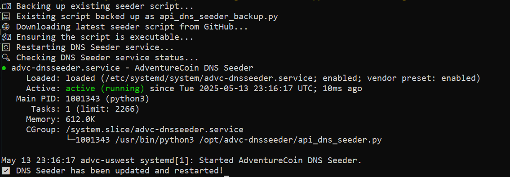
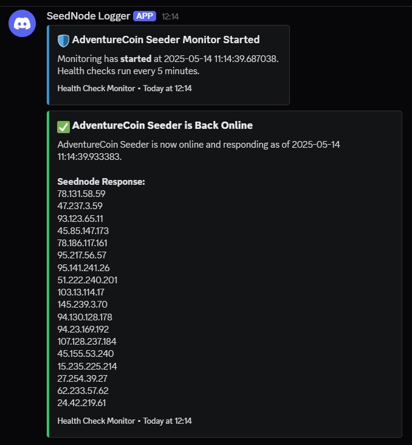

# 🌐 Lightweight DNS Seeder for AdventureCoin

A simple, API-driven, Python-based DNS seeder for your cryptocurrency network. It uses `dnslib` and a `/peers` API to serve healthy nodes over DNS.

---

## ⚙️ Requirements

Install Python dependencies:

```bash
pip install dnslib requests
```

---

## 🚀 One-Line Auto Installer

Run this to set up everything via `setup-dns-seeder.sh`:

```bash
curl -sL https://raw.githubusercontent.com/CryptoDevelopmentServices/Lightweight_DNS_Seeder/main/setup-dns-seeder.sh | sudo bash
```

> This script:
> - Installs dependencies
> - Copies `api_dns_seeder.py`
> - Sets up a systemd service
> - Opens port 8053 (TCP & UDP)
> - Starts the DNS Seeder

---

## 🚀 One-Line Auto Updater & Backup

Run this to update and backup everything via `update_dns_seeder.sh`:

```bash
curl -sL https://raw.githubusercontent.com/CryptoDevelopmentServices/Lightweight_DNS_Seeder/main/update_dns_seeder.sh | sudo bash
```
---

## 🛠️ Manual Setup (Optional)

### 1. Clone the Repo & Run Seeder

```bash
git clone https://github.com/CryptoDevelopmentServices/Lightweight_DNS_Seeder.git
cd Lightweight_DNS_Seeder
sudo python3 api_dns_seeder.py
```

---

## 🔥 Firewall Rules

Open DNS port 8053 for both protocols:

```bash
sudo ufw allow 8053
```

Also ensure your hosting provider/firewall allows it.

---

## 🌍 DNS Configuration

Point your A (IPv4) and AAAA (IPv6) records to the IP address of the server running this script:

```
seed.adventurecoin.quest → your.server.ip
```

---

## 🧩 Coin Integration

Update your `chainparams.cpp` file like so:

```cpp
vSeeds.emplace_back("seed.adventurecoin.quest");
```

---

## 📌 Features

- ✅ Lightweight, Python-based
- ✅ Uses your `/peers` API for dynamic peer list
- ✅ Supports both IPv4 and IPv6
- ✅ Auto-refreshes every 5 minutes
- ✅ systemd compatible for always-on background service

---

## 📸 Screenshots

### 1. Seeder Setup Script Running


### 2. Seeder Running via systemd


### 3. Seeder updated, backed up and Running via systemd


### 4. Seeder logger, running on discord


---

## 🤝 Maintained by

**[Crypto Development Services](https://github.com/CryptoDevelopmentServices)**  
Join the community on [Discord](https://discord.gg/vrvfhQ4FRa)

---
